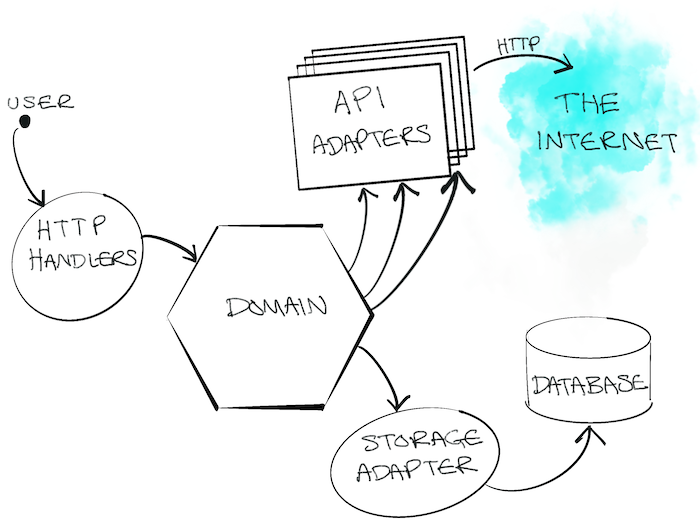
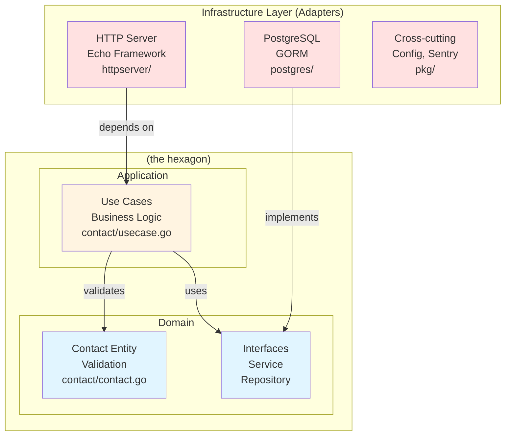

# Hexagon Go REST API

A Go REST API project following Hexagonal Architecture principles, featuring contact management with HTTP endpoints, PostgreSQL persistence, Sentry error reporting, and comprehensive testing with testcontainers.

---

## Table of Contents

- [Architecture](#architecture)
- [Development](#development)
- [Configuration](#configuration)
- [Running the Server](#running-the-server)
- [Database Migrations](#database-migrations)
- [Testing](#testing)
- [Linting](#linting)
- [Docker](#docker)
- [Project Structure](#project-structure)

---

## Architecture

This project follows **Hexagonal Architecture** with clear separation of concerns:



Below is a Mermaid diagram illustrating the architecture and dependencies:



**Layers:**
- **Domain Layer** ([`contact/`](contact/)): Business entities, validation logic, and interface definitions (`Service`, `Repository`)
- **Application Layer** ([`contact/usecase.go`](contact/usecase.go)): Business logic implementation (use cases) that coordinates between domain and infrastructure
- **Infrastructure Layer**: Adapters for external dependencies
  - [`httpserver/`](httpserver/) - Echo web framework HTTP handlers
  - [`postgres/`](postgres/) - GORM database implementation
  - [`pkg/`](pkg/) - Cross-cutting concerns (config, sentry, logging)

**Key Principles:**
- Dependencies point inward: Infrastructure depends on domain, never the reverse
- Domain defines interfaces; infrastructure implements them
- Dependency injection throughout the stack
- Comprehensive error handling with custom error codes ([`errs/`](errs/))

---

## Development

### Prerequisites

- Go 1.24.0 or higher
- Docker & Docker Compose (for local PostgreSQL)
- Air (for hot reload): `go install github.com/air-verse/air@latest`
- sql-migrate (for migrations): `go install github.com/rubenv/sql-migrate/...@latest`
- golangci-lint (for linting)

### Quick Start

1. **Initialize the project:**
   ```shell
   go mod download
   ```

2. **Start local database:**
   ```shell
   make local-db
   ```
   This starts PostgreSQL in Docker on port `33062`.

3. **Run database migrations:**
   ```shell
   make db/migrate
   ```

4. **Start the server with hot reload:**
   ```shell
   make run
   ```
   The server will start on port `8088` (default) and auto-reload on code changes.

5. **Run tests:**
   ```shell
   make test
   ```

### Development Workflow

- **Hot reload** is configured via [`.air.toml`](.air.toml)
  - Watches `*.go` files (excludes `*_test.go`)
  - Builds to `tmp/main` from `cmd/httpserver/`
  - Auto-restarts on file changes
- Use `make lint` to validate code quality
- Integration tests use `testcontainers` for isolated PostgreSQL instances

---

## Configuration

Configuration is managed through environment variables loaded via [`.env`](.env) file (see [`pkg/config/config.go`](pkg/config/config.go)).

### Environment Variables

Create a `.env` file in the project root:

```env
APP_ENV=local
PORT=8088
SENTRY_DSN=your-sentry-dsn-here
ALLOW_ORIGINS=*

DB_HOST=localhost
DB_USER=root
DB_PASS=123456
DB_PORT=33062
DB_NAME=teqlocal
ENABLE_SSL=false
```

### Configuration Loading

The application uses `envconfig` to load environment variables:
- Automatically loads `.env` file if present (via `godotenv`)
- Falls back to system environment variables
- Validates required fields on startup

---

## Running the Server

The main entrypoint is [`cmd/httpserver/main.go`](cmd/httpserver/main.go).

**Server Stack:**
- **Framework:** Echo (high performance HTTP router)
- **Middleware:** CORS, Gzip, Request ID, Recover, Security headers, Sentry
- **Error Handling:** Custom error handler maps domain errors to HTTP status codes
  - `EINVALID` → 400 Bad Request
  - `ENOTFOUND` → 404 Not Found
  - `EINTERNAL` → 500 Internal Server Error

**Server Initialization:**
```go
// 1. Load configuration
cfg, _ := config.LoadConfig()

// 2. Initialize infrastructure (database)
db, _ := postgres.NewConnection(postgres.Options{...})
contactRepo := postgres.NewContactRepository(db)

// 3. Create use cases
contactService := contact.NewUsecase(contactRepo)

// 4. Inject into server
server := httpserver.Default()
server.ContactService = contactService
server.Addr = fmt.Sprintf(":%d", cfg.Port)
server.Start()
```

Default port is `8088` (configurable via `PORT` environment variable).

---

## Database Migrations

Migration files are located in [`migrations/`](migrations/) and managed using `sql-migrate`.

### Configuration

Database migration settings are in [`dbconfig.yml`](dbconfig.yml):
- Environment: `development`
- Migration directory: `migrations/`
- Database connection configured via environment variables

### Commands

**Run migrations:**
```shell
make db/migrate
# or directly:
go run ./cmd/migrate
```

**Create a new migration:**
```shell
sql-migrate new -env="development" create-your-migration-name
```

This creates a new file in `migrations/` with timestamp prefix (e.g., `20260122111217-create-contacts-table.sql`).

---

## Testing

The project includes comprehensive unit and integration tests using `testify` for assertions/mocking and `testcontainers` for database integration tests.

### Test Strategy

**1. Unit Tests** - Mock dependencies using `testify/mock`:
- [`contact/usecase_test.go`](contact/usecase_test.go) - Mocks Repository to test business logic
- [`httpserver/contact_test.go`](httpserver/contact_test.go) - Mocks Service to test HTTP handlers

**2. Integration Tests** - Uses real PostgreSQL via `testcontainers`:
- [`httpserver/contact_integration_test.go`](httpserver/contact_integration_test.go) - Full stack testing
- [`postgres/contact_test.go`](postgres/contact_test.go) - Database layer testing

### Running Tests

```shell
# Run all tests with coverage
make test

# Run specific test
go test ./contact/... -v

# Run with coverage report
go test -cover -coverprofile=coverage.out ./...
go tool cover -html=coverage.out
```

### Test Database Setup

Integration tests automatically:
1. Start PostgreSQL container via testcontainers
2. Run migrations on test database
3. Clean up after tests complete

See [`postgres/postgres_test.go`](postgres/postgres_test.go) for shared test utilities.

---

## Linting

Code quality is enforced using `golangci-lint` with configuration in [`.golangci.yml`](.golangci.yml).

```shell
make lint
```

This runs multiple linters including:
- `gofmt`, `goimports` - Code formatting
- `govet` - Static analysis
- `errcheck` - Unchecked errors
- And more...

---

## Docker

**Local PostgreSQL:** 
- Docker Compose configuration: [`tools/compose/docker-compose.yml`](tools/compose/docker-compose.yml)
- Starts PostgreSQL 15 on port `33062`
- Credentials configured via `.env` file

```shell
make local-db  # Start PostgreSQL
```

**Application Dockerfiles:**
- [`cmd/httpserver/Dockerfile`](cmd/httpserver/Dockerfile) - Main server
- [`cmd/migrate/Dockerfile`](cmd/migrate/Dockerfile) - Database migrations

---

## Project Structure

```
cmd/
  httpserver/          # HTTP server entrypoint
  migrate/            # Database migration entrypoint
contact/
  contact.go          # Domain entity with validation
  usecase.go          # Service/Repository interfaces + implementation
  usecase_test.go     # Unit tests with mocks
httpserver/
  server.go           # Echo server setup & middleware
  contact.go          # Contact HTTP handlers
  health.go           # Health check handler
  request.go          # Request/response DTOs
  *_test.go           # Unit tests
  *_integration_test.go  # Integration tests
postgres/
  postgres.go         # Database connection
  contact.go          # Contact repository (GORM)
  contact_test.go     # Repository integration tests
  postgres_test.go    # Shared test utilities
errs/
  error.go            # Custom error types & codes
pkg/
  config/             # Configuration loader (envconfig)
  sentry/             # Sentry error reporting
migrations/           # SQL migration files (sql-migrate)
tools/compose/        # Docker Compose files
```

### Key Design Patterns

**Dependency Injection:**
```go
// Domain defines interface
type Service interface { AddContact(context.Context, Contact) error }

// Infrastructure implements it
type Usecase struct { r Repository }

// Server depends on interface, not implementation
type Server struct { ContactService contact.Service }
```

**Error Handling:**
```go
// Domain errors with codes
var ErrInvalidName = errs.Errorf(errs.EINVALID, "invalid name")

// Custom HTTP error handler maps codes
// EINVALID -> 400, ENOTFOUND -> 404, EINTERNAL -> 500
```

**Testing:**
- Unit tests mock dependencies (Repository, Service)
- Integration tests use testcontainers for real database
- Shared test utilities for database setup/cleanup

---

## Available Make Commands

```shell
make run         # Start server with hot reload (Air)
make test        # Run all tests with coverage
make local-db    # Start PostgreSQL in Docker
make db/migrate  # Run database migrations
make lint        # Run golangci-lint
```
