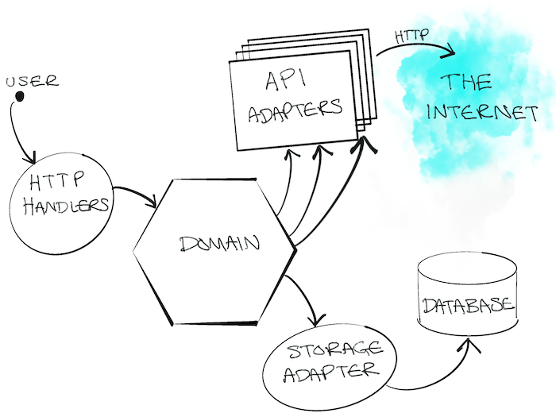
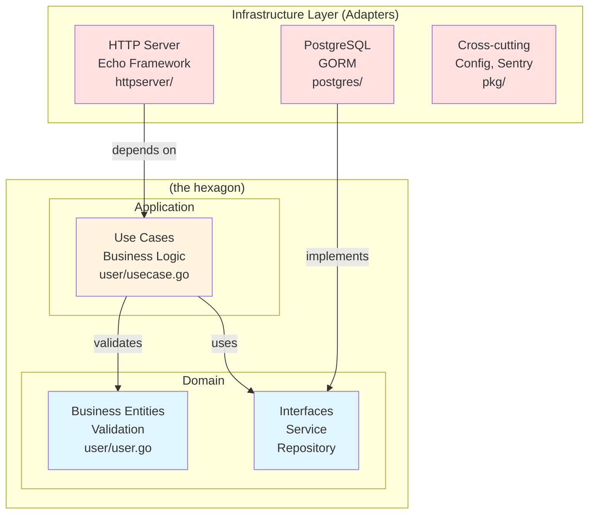

# Project Probation: Hotel Booking System

A Go REST API backend for a Hotel Booking System following Hexagonal Architecture.

This README is optimized for two practical goals:

1. Run the source locally without friction.
2. Manually verify and review core features with clear API checks.

---

## Table of Contents

- [Architecture](#architecture)
- [Development](#development)
- [Configuration](#configuration)
- [Running the Server](#running-the-server)
- [API Documentation (Swagger)](#api-documentation-swagger)
- [Feature Review (Manual QA)](#feature-review-manual-qa)
- [Database Migrations](#database-migrations)
- [Testing](#testing)
- [Linting](#linting)
- [Docker](#docker)
- [Project Structure](#project-structure)

---

## Architecture

This project follows **Hexagonal Architecture** with clear separation of concerns:



Below is a Mermaid diagram illustrating the architecture and dependencies:


```mermaid
graph TB
    subgraph "Infrastructure Layer (Adapters)"
        HTTP[HTTP Server<br/>Echo Framework<br/>httpserver/]
        DB[PostgreSQL<br/>GORM<br/>postgres/]
        PKG[Cross-cutting<br/>Config, Sentry<br/>pkg/]
    end

    subgraph Hexagon["(the hexagon)"]
        subgraph "Application"
        UC[Use Cases<br/>Business Logic<br/>user/usecase.go]
        end

        subgraph "Domain"
        ENT[Business Entities<br/>Validation<br/>user/user.go]
            INTF[Interfaces<br/>Service<br/>Repository]
        end
    end

    HTTP -->|depends on| UC
    DB -->|implements| INTF
    UC -->|uses| INTF
    UC -->|validates| ENT

    style ENT fill:#e1f5ff
    style INTF fill:#e1f5ff
    style UC fill:#fff4e1
    style HTTP fill:#ffe1e1
    style DB fill:#ffe1e1
    style PKG fill:#ffe1e1
```

**Layers:**

- **Domain Layer** ([`user/`](user/)): User entity, validation logic, and interface definitions (`Service`, `Repository`)
- **Application Layer** ([`user/usecase.go`](user/usecase.go), [`auth/usecase.go`](auth/usecase.go)): Business logic implementation (user management + authentication)
- **Infrastructure Layer**: Adapters for external dependencies
  - [`httpserver/`](httpserver/) - Echo web framework HTTP handlers
  - [`postgres/`](postgres/) - GORM database implementation
  - [`pkg/`](pkg/) - Cross-cutting concerns (config, sentry, logging, hashing, jwt, oauth)

**Key Principles:**

- Dependencies point inward: Infrastructure depends on domain, never the reverse
- Domain defines interfaces; infrastructure implements them
- Dependency injection throughout the stack
- Comprehensive error handling with custom error codes ([`errs/`](errs/))

---

## Development

### Prerequisites

- Go 1.24.0 or higher
- Docker & Docker Compose (for local PostgreSQL)
- Air (for hot reload): `go install github.com/air-verse/air@latest`
- sql-migrate (for migrations): `go install github.com/rubenv/sql-migrate/...@latest`
- golangci-lint (for linting)

### Quick Start

1. Install prerequisites: Go, Docker, Make.

2. Initialize dependencies:

```shell
go mod download
```

3. Create `.env` (see [Configuration](#configuration)).

Recommended: keep a local template file (for example `.env.example`) and copy it to `.env` before running.

4. Start local database:

```shell
make local-db
```

5. Run migrations:

```shell
make db/migrate
```

6. Seed demo data for manual API review:

```shell
make db/seed
```

This creates one demo hotel in `ha noi` with room inventory for `2026-04-01` to `2026-04-03`.

7. Start server with hot reload:

```shell
make run
```

8. Run CI-equivalent checks before pushing:

```shell
make test/ci
make lint
```

### Development Workflow

- **Hot reload** is configured via [`.air.toml`](.air.toml)
  - Watches `*.go` files (excludes `*_test.go`)
  - Builds to `tmp/main` from `cmd/httpserver/`
  - Auto-restarts on file changes
- Use `make lint` to validate code quality
- Use `make format` to run `gofmt -w .`
- Use `make swag` to generate Swagger docs from annotations
- Integration tests use `testcontainers` for isolated PostgreSQL instances

---

## Configuration

Configuration is managed through environment variables loaded via [`.env`](.env) file (see [`pkg/config/config.go`](pkg/config/config.go)).

### Environment Variables

Create a `.env` file in the project root:

```env
APP_ENV=local
PORT=8088
SENTRY_DSN=your-sentry-dsn-here
ALLOW_ORIGINS=*

DB_HOST=localhost
DB_USER=root
DB_PASS=123456
DB_PORT=33062
DB_NAME=teqlocal
ENABLE_SSL=false

AUTH_JWT_SECRET=your-jwt-secret
AUTH_TOKEN_TTL=60
AUTH_REFRESH_TTL=2592000
AUTH_GOOGLE_CLIENT_ID=your-google-client-id
AUTH_GOOGLE_CLIENT_SECRET=your-google-client-secret
AUTH_GOOGLE_REDIRECT_URL=http://localhost:8088/api/auth/google/callback
AUTH_RESET_PASSWORD_URL=http://localhost:3000/reset-password
AUTH_RESEND_API_KEY=re_xxxxxxxxx
AUTH_RESEND_FROM_EMAIL=onboarding@resend.dev
AUTH_RESEND_FROM_NAME=Hexagon Hotel

# S3 (AWS)
# S3_REGION=ap-southeast-1
# S3_BUCKET=your-bucket-name
# S3_ENDPOINT=
# S3_ACCESS_KEY_ID=
# S3_SECRET_ACCESS_KEY=

# S3 (LocalStack)
S3_REGION=us-east-1
S3_BUCKET=hotel-images
S3_BASE_URL=
S3_PREFIX=
S3_ENDPOINT=http://localhost:4566
S3_ACCESS_KEY_ID=test
S3_SECRET_ACCESS_KEY=test
S3_SESSION_TOKEN=
```

Notes:

- If `S3_ENDPOINT` is set and `S3_BASE_URL` is empty, upload URLs are returned as `<S3_ENDPOINT>/<S3_BUCKET>/<object-key>` (works for LocalStack).

### Configuration Loading

The application uses `envconfig` to load environment variables:

- Automatically loads `.env` file if present (via `godotenv`)
- Falls back to system environment variables
- Validates required fields on startup

---

## Running the Server

The main entrypoint is [`cmd/httpserver/main.go`](cmd/httpserver/main.go).

**Server Stack:**

- **Framework:** Echo (high performance HTTP router)
- **Middleware:** CORS, Gzip, Request ID, Recover, Security headers, Sentry
- **Error Handling:** Custom error handler maps domain errors to HTTP status codes
  - `EINVALID` → 400 Bad Request
  - `ENOTFOUND` → 404 Not Found
  - `EINTERNAL` → 500 Internal Server Error

**Server Initialization:**

```go
// 1. Load configuration
cfg, _ := config.LoadConfig()

// 2. Initialize infrastructure (database)
db, _ := postgres.NewConnection(postgres.Options{...})
userRepo := postgres.NewUserRepository(db)

// 3. Create use cases
userService := user.NewUsecase(userRepo, hashing.NewBcryptHasher())
authService := auth.NewUsecase(
    userRepo,
    postgres.NewOAuthProviderAccountRepository(db),
    postgres.NewRefreshTokenRepository(db),
    postgres.NewPasswordResetTokenRepository(db),
    hashing.NewBcryptHasher(),
    jwtProvider,
    googleProvider,
    resetMailer,
    cfg.Auth.ResetPasswordURL,
)

// 4. Inject into server
server := httpserver.Default(cfg)
server.UserService = userService
server.AuthService = authService
server.Addr = fmt.Sprintf(":%d", cfg.Port)
server.Start()
```

Default port is `8088` (configurable via `PORT` environment variable).

Quick health check:

```shell
curl -i http://localhost:8088/health
```

---

## API Documentation (Swagger)

After starting the server, open Swagger UI at:

- `http://localhost:8088/swagger/index.html`

If `PORT` is changed in `.env`, use:

- `http://localhost:<PORT>/swagger/index.html`

If Swagger docs are outdated, regenerate:

```shell
make swag
```

---

## Feature Review (Manual QA)

Use this section to quickly review behavior after the app is running.

> Note: Search endpoints require real hotel/room/inventory data in DB. Empty data will return valid but empty results.
>
> This repository includes a built-in demo seed command: `make db/seed`.
> Run it after `make db/migrate` to test the sample search payloads below immediately.

### 1) Search hotels (offset pagination)

```shell
curl -X POST http://localhost:8088/api/search/hotels \
  -H "Content-Type: application/json" \
  -d '{
    "query": "ha noi",
    "checkInAt": "2026-04-01",
    "checkOutAt": "2026-04-03",
    "roomCount": 2,
    "adultCount": 3,
    "childrenAges": [5],
    "ratingMin": 4,
    "offset": 0,
    "pageSize": 10
  }'
```

Expected checks:

- `result.data.hotels` exists.
- `result.data.pagination` includes `page`, `pageSize`, `offset`, `total`, `totalPages`.
- Each hotel has `minPrice`, `availableRoomCount`, `matchesRequested`, `flexibleMatch`.

### 2) Search rooms for one hotel

Use a real `hotel_id` from step 1 (`result.data.hotels[*].hotelId`).

```shell
curl -X POST http://localhost:8088/api/search/hotels/{hotel_id}/rooms \
  -H "Content-Type: application/json" \
  -d '{
    "checkInAt": "2026-04-01",
    "checkOutAt": "2026-04-03",
    "roomCount": 2,
    "adultCount": 3,
    "childrenAges": [5],
    "amenityIds": []
  }'
```

Expected checks:

- Response contains `hotelId`, `requestedRoomCount`, `strictMatch`.
- `rooms[]` contains availability and capacity fields.
- Amenity fields are populated when available.

### 3) Search room combinations for one hotel

Use the same `hotel_id` collected from step 1.

```shell
curl -X POST http://localhost:8088/api/search/hotels/{hotel_id}/room-combinations \
  -H "Content-Type: application/json" \
  -d '{
    "checkInAt": "2026-04-01",
    "checkOutAt": "2026-04-03",
    "roomCount": 1,
    "adultCount": 5,
    "childrenAges": [5],
    "amenityIds": [],
    "maxCombinations": 5
  }'
```

Expected checks:

- `combinations[]` exists.
- Each combination includes `items`, `totalPrice`, `totalRooms`, `totalOccupancy`.
- Number of results does not exceed `maxCombinations`.

---

## Database Migrations

Migration files are located in [`migrations/`](migrations/) and managed using `sql-migrate`.

### Configuration

Database migration settings are in [`dbconfig.yml`](dbconfig.yml):

- Environment: `development`
- Migration directory: `migrations/`
- Database connection configured via environment variables

### Commands

**Run migrations:**

```shell
make db/migrate
# or directly:
go run ./cmd/migrate
```

**Seed demo data (manual QA):**

```shell
make db/seed
```

This command is idempotent for the demo records and can be re-run safely in local development.

**Create a new migration:**

```shell
sql-migrate new -env="development" create-your-migration-name
```

This creates a new file in `migrations/` with timestamp prefix (e.g., `20260202161352-create-users-table.sql`).

---

## Testing

The project includes comprehensive unit and integration tests using `testify` for assertions/mocking and `testcontainers` for database integration tests.

### Test Strategy

**1. Unit Tests** - Mock dependencies using `testify/mock`:

- [`user/usecase_test.go`](user/usecase_test.go) - Mocks repository/hasher to test user business logic
- [`httpserver/user_test.go`](httpserver/user_test.go) - Mocks user service to test user HTTP handlers

**2. Integration Tests** - Uses real PostgreSQL via `testcontainers`:

- [`httpserver/server_integration_test.go`](httpserver/server_integration_test.go) - Full stack testing setup
- [`postgres/postgres_test.go`](postgres/postgres_test.go) - Database layer testing utilities

### Running Tests

```shell
# Run CI-equivalent tests (recommended before push)
make test/ci

# Or run plain coverage tests
make test

# Run specific test
go test ./user/... -v

# Run with coverage report
go test -cover -coverprofile=coverage.out ./...
go tool cover -html=coverage.out
```

### Test Database Setup

Integration tests automatically:

1. Start PostgreSQL container via testcontainers
2. Run migrations on test database
3. Clean up after tests complete

See [`postgres/postgres_test.go`](postgres/postgres_test.go) for shared test utilities.

---

## Linting

Code quality is enforced using `golangci-lint` with configuration in [`.golangci.yml`](.golangci.yml).

```shell
make lint
```

This runs multiple linters including:

- `govet` - Static analysis
- `errcheck` - Unchecked errors
- And more...

Formatting is run separately:

```shell
make format
```

Generate Swagger docs:

```shell
make swag
# equivalent to:
swag init -g cmd/httpserver/main.go
```

---

## Docker

**Local PostgreSQL:**

- Docker Compose configuration: [`tools/compose/docker-compose.yml`](tools/compose/docker-compose.yml)
- Starts PostgreSQL 15 on port `33062`
- Credentials configured via `.env` file

```shell
make local-db  # Start PostgreSQL
```

**S3 / LocalStack note:**

- `make local-db` currently starts PostgreSQL only.
- `tools/compose/docker-compose.yml` does not include a LocalStack service yet.
- If you need S3-compatible local testing, run LocalStack separately and keep `S3_ENDPOINT` in `.env` aligned.

**Application Dockerfiles:**

- [`cmd/httpserver/Dockerfile`](cmd/httpserver/Dockerfile) - Main server
- [`cmd/migrate/Dockerfile`](cmd/migrate/Dockerfile) - Database migrations
- [`cmd/seed/Dockerfile`](cmd/seed/Dockerfile) - Demo seed job for manual QA

**Run full stack with Docker (db + migrate + seed + api):**

```shell
make docker/up
```

Then verify:

```shell
curl -i http://localhost:8088/health
```

Useful Docker commands:

```shell
make docker/logs    # Follow API logs
make docker/migrate # Re-run migrations job
make docker/seed    # Re-run demo seed job
make docker/down    # Stop full stack
```

**Production logging note:**

- API emits structured JSON logs to stdout (application logs + HTTP access logs).
- This format is container-friendly and works with log collectors (e.g. Loki/ELK/CloudWatch).

---

## Project Structure

```
cmd/
  httpserver/          # HTTP server entrypoint
  migrate/            # Database migration entrypoint
  seed/               # Demo seed entrypoint
auth/
  usecase.go          # Authentication use cases (login/refresh/oauth)
httpserver/
  server.go           # Echo server setup & middleware
  user.go             # User HTTP handlers
  auth.go             # Auth HTTP handlers
  health.go           # Health check handler
  request.go          # Request DTOs
  response.go         # Response DTOs
  *_test.go           # Unit tests
  *_integration_test.go  # Integration tests
postgres/
  postgres.go         # Database connection
  user.go             # User repository (GORM)
  login_attempt.go    # Login attempt repository (GORM)
  postgres_test.go    # Shared test utilities
user/
  user.go             # User entity + validation rules
  usecase.go          # User service/repository interfaces + implementation
  usecase_test.go     # Unit tests with mocks
errs/
  error.go            # Custom error types & codes
pkg/
  config/             # Configuration loader (envconfig)
  hashing/            # Password hashing
  jwt/                # JWT token provider
  oauth/google/       # Google OAuth provider
  sentry/             # Sentry error reporting
migrations/           # SQL migration files (sql-migrate)
tools/compose/        # Docker Compose files
```

### Key Design Patterns

**Dependency Injection:**

```go
// Domain defines interface
type Service interface { AddUser(context.Context, User) error }

// Infrastructure implements it
type Usecase struct { r Repository }

// Server depends on interface, not implementation
type Server struct { UserService user.Service }
```

**Error Handling:**

```go
// Domain errors with codes
var ErrInvalidName = errs.Errorf(errs.EINVALID, "invalid name")

// Custom HTTP error handler maps codes
// EINVALID -> 400, ENOTFOUND -> 404, EINTERNAL -> 500
```

**Testing:**

- Unit tests mock dependencies (Repository, Service)
- Integration tests use testcontainers for real database
- Shared test utilities for database setup/cleanup

---

## Available Make Commands

```shell
make run         # Start server with hot reload (Air)
make test/ci     # Run tests exactly like CI workflow (junit + coverage.out)
make test        # Run go test with coverage
make local-db    # Start PostgreSQL in Docker
make db/migrate  # Run database migrations
make db/seed     # Seed demo hotel/room/inventory data for manual QA
make docker/up   # Run full Docker stack (db + migrate + seed + api)
make docker/down # Stop full Docker stack
make docker/logs # Tail API logs from Docker stack
make lint        # Run golangci-lint
make format      # Format Go code (gofmt -w .)
make swag        # Generate Swagger docs
```
